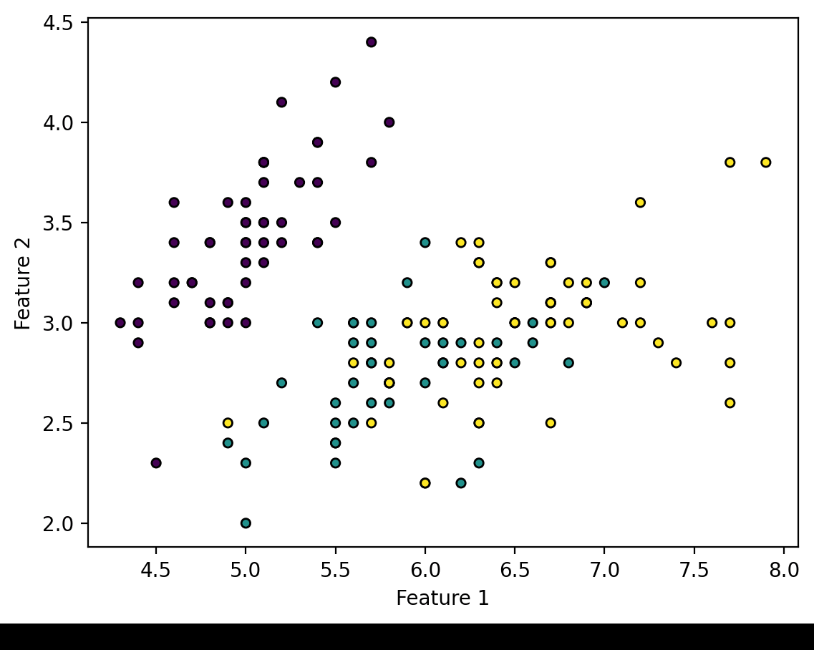
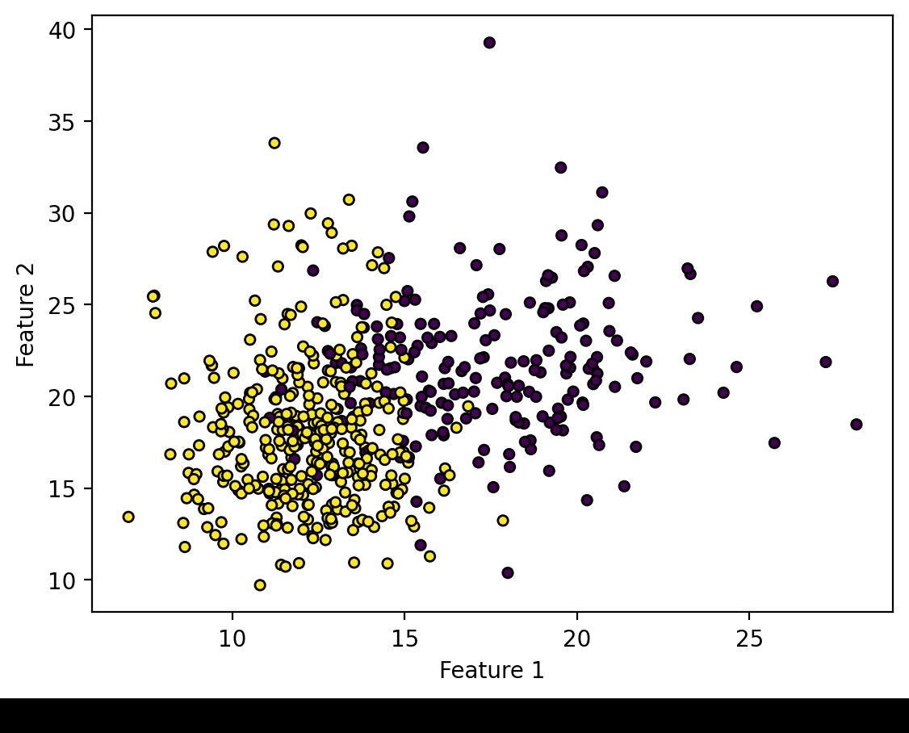
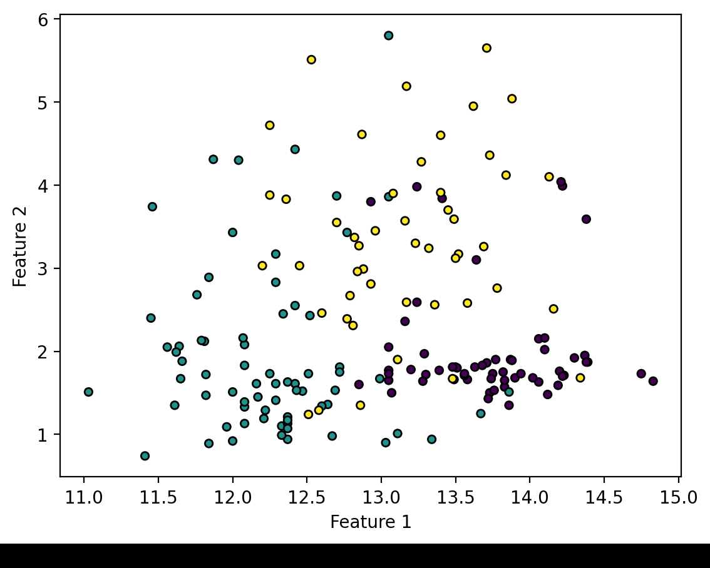

# ML_Assignment3

## Set Local Environment
Run the depedencies mentioned in `requirements.txt`

## Run the streamlit project
Run the depedencies mentioned in `requirements.txt`. You can find deployed version [here](https://siddheshkanawade-ml-assignment3-app-3cj3by.streamlit.app/)

## Results
1. Iris Dataset

2. Breast Cancer dataset

3. Wine Dataset
